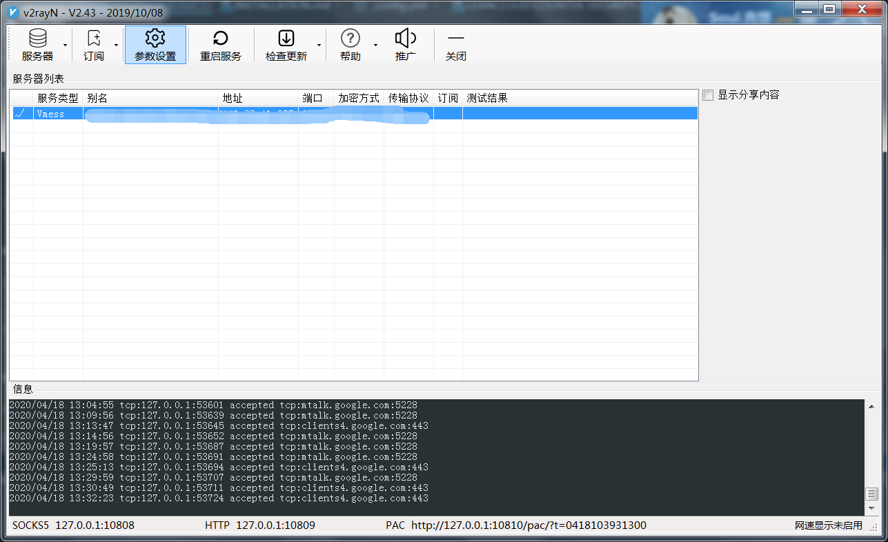
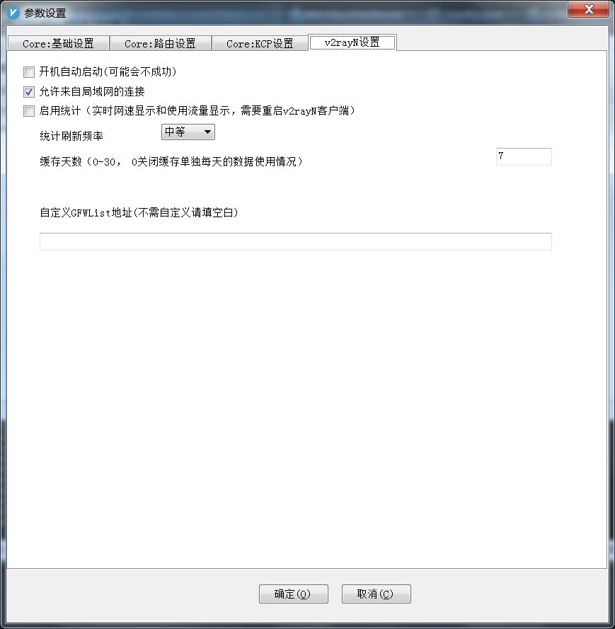
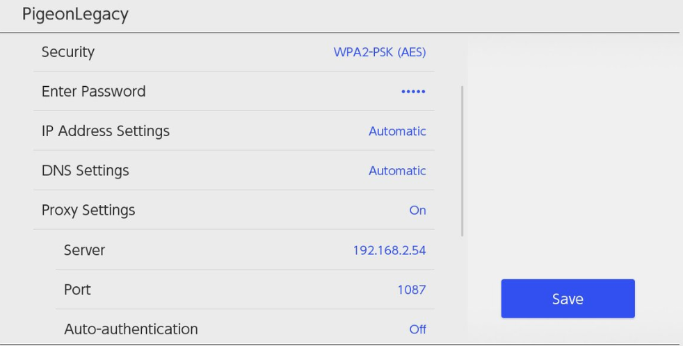

博主的switch,到货不久,发现无法连上商店,正好手上有v2ray，研究了下，发现可以通过v2ray共享http连接，步骤如下

### v2ray配置(以v2rayN为例)
默认启用http代理，
点击参数设置
打开v2ray设置,勾选 允许来自局域网的连接
### switch网络设置
确保switch和电脑在同一个局域网下，
打开switch的网络设置,设置网络代理,ip是电脑的网络ip,在填上http代理端口号(v2rayN默认是10809)。

这个方法用来eshop加速完全够用，下载速度可观。